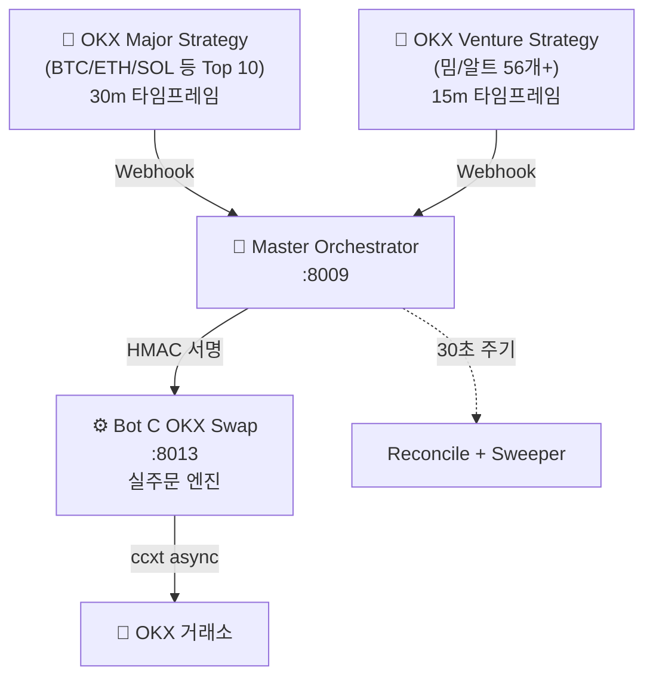

# 📊 OKX 자동매매 봇 거래내역 종합 분석 보고서

> **분석 기준일**: 2026-08-24  
> **분석 데이터**: [`trades.jsonl`](file:///home/hongsoonil02/quant_system/state/trades.jsonl) (3,317건)  
> **분석 기간**: 2026-08-09 ~ 2026-08-24 (14.7일)

---

## 1. 시스템 아키텍처 요약

| 컴포넌트 | 파일 | 역할 |
|---------|------|------|
| Major Strategy | [`okx_major_strategy.py`](file:///home/hongsoonil02/quant_system/okx_major_strategy.py) | BTC/ETH/SOL 등 메이저 10종목, 30m, Supertrend+StochRSI |
| Venture Strategy | [`okx_venture_strategy.py`](file:///home/hongsoonil02/quant_system/okx_venture_strategy.py) | 밈/알트 56종목+, 15m, Mean Reversion BB+DCA |
| Master Orchestrator | [`master_bot_orchestrator.py`](file:///home/hongsoonil02/quant_system/master_bot_orchestrator.py) | 신호 라우팅, 포지션 관리, 헬스체크, 스윕 |
| Bot C (집행기) | [`bot_c_okx_swap.py`](file:///home/hongsoonil02/quant_system/bot_c_okx_swap.py) | OKX Futures 실주문 (Hedge Mode, Market Order) |
| Strategy Common | [`strategy_common.py`](file:///home/hongsoonil02/quant_system/strategy_common.py) | 공통 TA, DCA, 켈리 사이징, 청산 로직 |

---

## 2. 전체 성과 요약

| 지표 | 값 | 평가 |
|-----|----|----|
| **총 거래 기록** | 3,317건 (14.7일) | 하루 평균 ~226건 |
| **완료 라운드트립** | 1,288건 | P&L 산출 가능 |
| **승률** | **67.5%** (869승 / 419패) | ✅ 양호 |
| **평균 수익률** | **+4.83%** (거래당) | ✅ 우수 |
| **누적 수익률** | **+6,225%** | ⚠️ 레버리지 10x 기반 |
| **손익비 (W/L)** | **3.98** | ✅ 우수 (승리 시 손실 대비 ~4배 수익) |
| **Profit Factor** | **8.26** | ✅ 탁월 |
| **최대 낙폭** | **58.91%** | ⚠️ 주의 필요 |
| **최대 연승** | 23연승 | |
| **최대 연패** | 7연패 | |

> [!IMPORTANT]
> 누적 수익률 +6,225%는 **레버리지 10x 기준 개별 거래 수익률의 단순 합산**입니다. 실제 계좌 수익률은 포지션 사이징(자본의 5~18%) 적용 시 이보다 훨씬 낮습니다.

---

## 3. 방향별 성과 — 핵심 발견

| 방향 | 거래수 | 승률 | 누적 P&L | Profit Factor |
|------|--------|------|----------|---------------|
| **LONG** 📈 | 1,076 | **74.4%** | **+6,238%** | **11.39** |
| **SHORT** 📉 | 212 | **32.1%** | **-12.8%** | **0.95** |

> [!CAUTION]
> **숏 포지션은 사실상 적자** (PF 0.95 < 1.0). 전체 수익은 거의 전적으로 **롱 포지션**에서 발생합니다. 최근 14일이 강세장이었기에 롱이 유리했지만, 약세 전환 시 양방향 전략에 문제가 될 수 있습니다.

---

## 4. 섹터별 성과 분석

| 섹터 | 거래수 | 승률 | 누적 P&L | PF | 평균 보유 |
|------|--------|------|----------|-----|----------|
| 🟦 **Major** (BTC/ETH 등) | 462 | 70.8% | +2,783% | 14.14 | 28.1h |
| 🟧 **Meme** (DOGE/PEPE 등) | 181 | 69.1% | +1,431% | 10.61 | 13.1h |
| 🟩 **Alt** (나머지 알트) | 645 | 64.7% | +2,011% | 5.05 | 19.6h |

> [!TIP]
> - **Major 섹터**가 가장 높은 PF(14.14)와 안정적 승률을 보임
> - **Meme 섹터**는 빠른 회전(평균 13h)으로 높은 효율
> - **Alt 섹터**는 거래량 최다(645건)이나 PF가 상대적으로 낮음 → 종목 선별 강화 여지

---

## 5. 심볼별 상위 성과

### 🏆 Top 10 수익 심볼

| 심볼 | 거래수 | 승/패 | 승률 | 누적 P&L |
|------|--------|-------|------|----------|
| XRP/USDT | 84 | 69/15 | **82.1%** | **+797.5%** |
| CAP/USDT | 54 | 35/19 | 64.8% | +647.2% |
| TRUMP/USDT | 42 | 21/21 | 50.0% | +629.4% |
| ETH/USDT | 71 | 48/23 | 67.6% | +628.8% |
| DOGE/USDT | 34 | 31/3 | **91.2%** | +468.2% |
| ZEC/USDT | 43 | 41/2 | **95.3%** | +422.9% |
| AVAX/USDT | 35 | 24/11 | 68.6% | +235.4% |
| PEPE/USDT | 22 | 21/1 | **95.5%** | +234.4% |
| ADA/USDT | 56 | 37/19 | 66.1% | +217.7% |
| DOT/USDT | 59 | 42/17 | 71.2% | +214.0% |

### 💀 Top 10 손실 심볼

| 심볼 | 거래수 | 승/패 | 승률 | 누적 P&L |
|------|--------|-------|------|----------|
| GPS/USDT | 7 | 4/3 | 57.1% | **-64.7%** |
| SNXX/USDT | 30 | 17/13 | 56.7% | -38.3% |
| POL/USDT | 17 | 7/10 | 41.2% | -21.6% |
| MOVE/USDT | 9 | 4/5 | 44.4% | -17.2% |
| FIL/USDT | 5 | 1/4 | 20.0% | -13.8% |
| APR/USDT | 5 | 0/5 | 0.0% | -10.8% |
| DASH/USDT | 8 | 5/3 | 62.5% | -9.9% |
| WLFI/USDT | 2 | 0/2 | 0.0% | -4.6% |
| USELESS/USDT | 7 | 1/6 | 14.3% | -4.1% |
| ZAMA/USDT | 9 | 6/3 | 66.7% | -3.7% |

> [!WARNING]
> **GPS** (-64.7%), **SNXX** (-38.3%), **POL** (-21.6%)이 손실 상위. 특히 GPS는 7건 중 3건 패배에도 불구하고 대형 손실 발생 — 하드스탑이 너무 넓거나 DCA 물타기 후 청산되었을 가능성.

---

## 6. 보유 시간 분석

| 구간 | 거래수 | 비율 |
|------|--------|------|
| < 1시간 | 289건 | 22.4% |
| 1~4시간 | 215건 | 16.7% |
| 4~12시간 | 201건 | 15.6% |
| 12~24시간 | 223건 | 17.3% |
| **24시간+** | **360건** | **28.0%** |

| 분류 | 평균 보유 시간 |
|------|----------------|
| 전체 | 21.8시간 |
| **수익 거래** | **27.9시간** |
| **손실 거래** | **8.9시간** |

> [!NOTE]
> 수익 거래가 손실 거래보다 **3배 이상 오래 보유** — "Let profits run, cut losses short" 원칙을 잘 따르고 있습니다. 24h+ 거래가 28%로 가장 많은데, 이는 스윕(24h 정체 포지션 강제청산) 경계선에 해당합니다.

---

## 7. 주간 성과 추이

| 주차 | 거래수 | 승률 | 주간 P&L | 누적 P&L |
|------|--------|------|----------|----------|
| W32 (8/9~) | 32 | 65.6% | +199.8% | +199.8% |
| **W33 (8/16~)** | **1,208** | **67.6%** | **+5,781.1%** | **+5,980.8%** |
| W34 (8/23~) | 48 | 64.6% | +244.5% | +6,225.3% |

> [!IMPORTANT]
> W33에 거래 폭증(1,208건) — 시스템 본격 가동 및 DCA/재진입 로직 활성화 시점. 이후 W34는 거래 활동이 급감(48건)했는데, 이는 **Chop Filter (ADX < 20 차단)** 도입 영향으로 보입니다.

---

## 8. 운영 이슈 분석

### 🔴 치명적 에러 (25건)
- **51008 (증거금 부족)**: 다수 발생 — 포지션이 집중될 때 여유 마진 소진
- **51004 (포지션 한도 초과)**: BEAT-USDT 등 소형 종목에서 반복 발생

### ⚠️ 스윕(강제청산) 추정: 724건
- 전체 거래의 **21.8%**가 order_id 없는 청산 → Master Sweeper(24h 정체 포지션 청산)로 추정
- 전략적 청산이 아닌 **시간 기반 기계적 청산**이 상당 비율

### 🛡️ Guard 거부: 855건
- Master Guard의 포지션 제한(최대 20개) 또는 반대 방향 보유 시 진입 거부

### 🔄 DCA 활동: 609건
- 물타기(DCA) 진입이 활발하게 작동 중 (최대 8회)

### 👻 Ghost 인스턴스 감지
- `bot_c_okx_swap.py 8003` (레거시 포트) 프로세스가 현재 실행 중 — Ghost Guard에 의해 차단될 예정이나, 리소스 낭비

---

## 9. 현재 상태 (2026-08-24 22:00 UTC)

| 봇 | 상태 | 사이클 | 관찰 심볼 |
|----|------|--------|----------|
| Major Strategy | ✅ 가동 중 | #1,070 | 9개 (BTC/ETH/SOL 등) |
| Venture Strategy | ✅ 가동 중 | #800 | 55~58개 |
| Bot C (집행기) | ✅ 가동 중 | :8013 | - |
| Master Orchestrator | ✅ 가동 중 | - | - |

> 현재 보유 포지션: **1~2개** (대부분 청산 완료 상태)

---

## 10. 핵심 개선 권고사항

### 🔴 긴급

| # | 문제 | 권고 |
|---|------|------|
| 1 | **숏 전략 적자** (PF 0.95) | 숏 진입 임계값 상향 또는 숏 비중 축소 검토. 롱 편향 시장에서 숏은 역추세 → 손익비 불리 |
| 2 | **Max DD 58.9%** | 계좌 레벨 DD 제한(서킷 브레이커) 검토 — 일별 -10% 초과 시 신규 진입 차단 등 |
| 3 | **Ghost 프로세스** (8003포트) | `kill` 처리 필요 — CPU 71% 점유 중 |

### 🟡 개선

| # | 문제 | 권고 |
|---|------|------|
| 4 | **스윕 청산 비율 21.8%** | 전략적 청산이 아닌 시간초과 청산 → trailing stop 로직 개선 또는 스윕 조건 완화 |
| 5 | **GPS/SNXX/POL 반복 손실** | Churn Filter 강화 or 블랙리스트 추가 검토 |
| 6 | **W34 거래 급감** | Chop Filter가 과도하게 신호를 차단하고 있을 수 있음 — ADX 임계값(현재 20) 조정 검토 |
| 7 | **DCA 609건** | 물타기가 수익성에 기여하는지 별도 분석 필요 — DCA 없이 단일 진입만 했을 때 PF 비교 |

### 🟢 강점

| # | 내용 |
|---|------|
| ✅ | 승률 67.5%, 손익비 3.98 — 뛰어난 기본 전략 성과 |
| ✅ | 수익 거래 장기 보유(28h) vs 손실 빠른 컷(9h) — 원칙적 트레이딩 |
| ✅ | ZEC(95.3%), PEPE(95.5%), DOGE(91.2%) 등 특정 종목에서 압도적 승률 |
| ✅ | Master Guard, Reconcile, Sweeper 등 안전장치 정상 작동 |
| ✅ | 켈리 공식 기반 포지션 사이징 + 섹터별 파라미터 차등화 |
